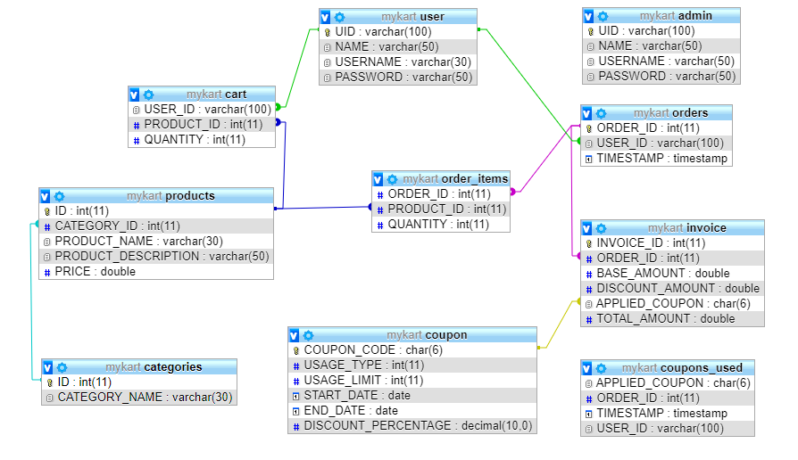

# MyCart 🛒
A sample E-Commerce Command Line Interface app built with Kotlin and MySQL for data storage. 

## How to setup? 🛠
- Clone this repository.
- Setup Database and Project

#### Database / MySQL Setup 🗄️
- Open XAMPP control panel.
- Start on **Apache** and **MySQL**
- Open browser → Go to [`localhost/phpmyadmin`](http://localhost/phpmyadmin)
- Sign in with credentials.
- Select `Import` → Select File → Choose [`db/mykart.sql`](db/mykart.sql) file.
- Click `Go`.
Thus database setup is successful.

#### Project Setup 💾
- Open ***IntellJ Idea*** and *Import* this project.
- Configure [`Config.kt`](src/main/kotlin/dev/shreyaspatil/mycart/Config.kt) file. Replace below fields with your confiurations.
  - `DATABASE_HOST` - Database Host Address
  - `DATABASE_USERNAME` - Username of your database
  - `DATABASE_PASSWORD` - Password of your database
  - `DATABASE_NAME` - Name of your database
- Run ▶️ project with [`MyCart.kt`](src/main/kotlin/dev/shreyaspatil/mycart/MyCart.kt)
  
## Package Structure

    dev.shreyaspatil.mycart    # Root Package
    .
    ├── admin                  # Admin Activity Classes
    ├── user                   # User Activity Classes
    ├── common                 # Common Activity Classes (User and Admin)
    ├── model                  # Model classes
    ├── repository             # Single source of data for application           
    ├── session                # Session Management Classes
    └── utils                  # Utility Classes / Kotlin extensions

## ER Diagram
This ER diagram is generated by [phpMyAdmin](https://www.phpmyadmin.net/)

